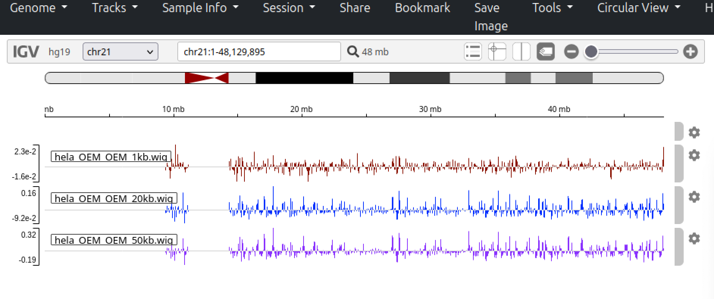
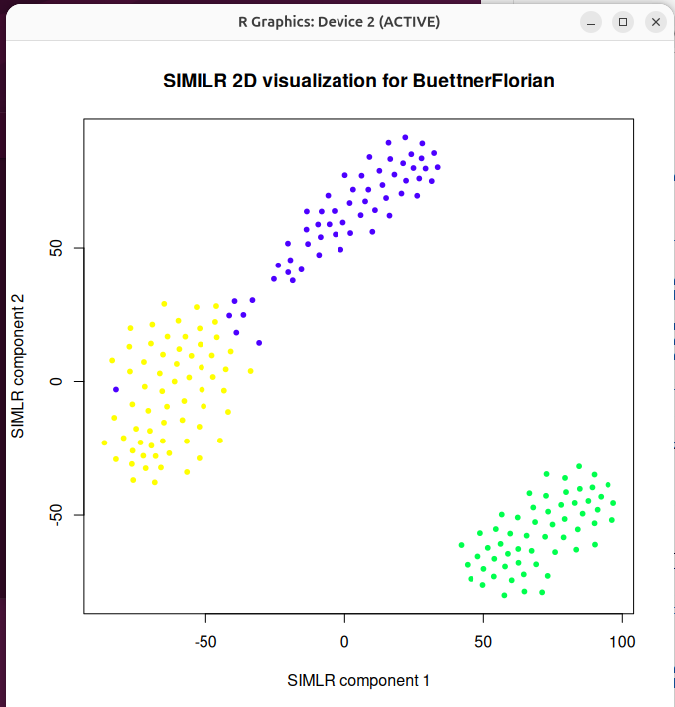
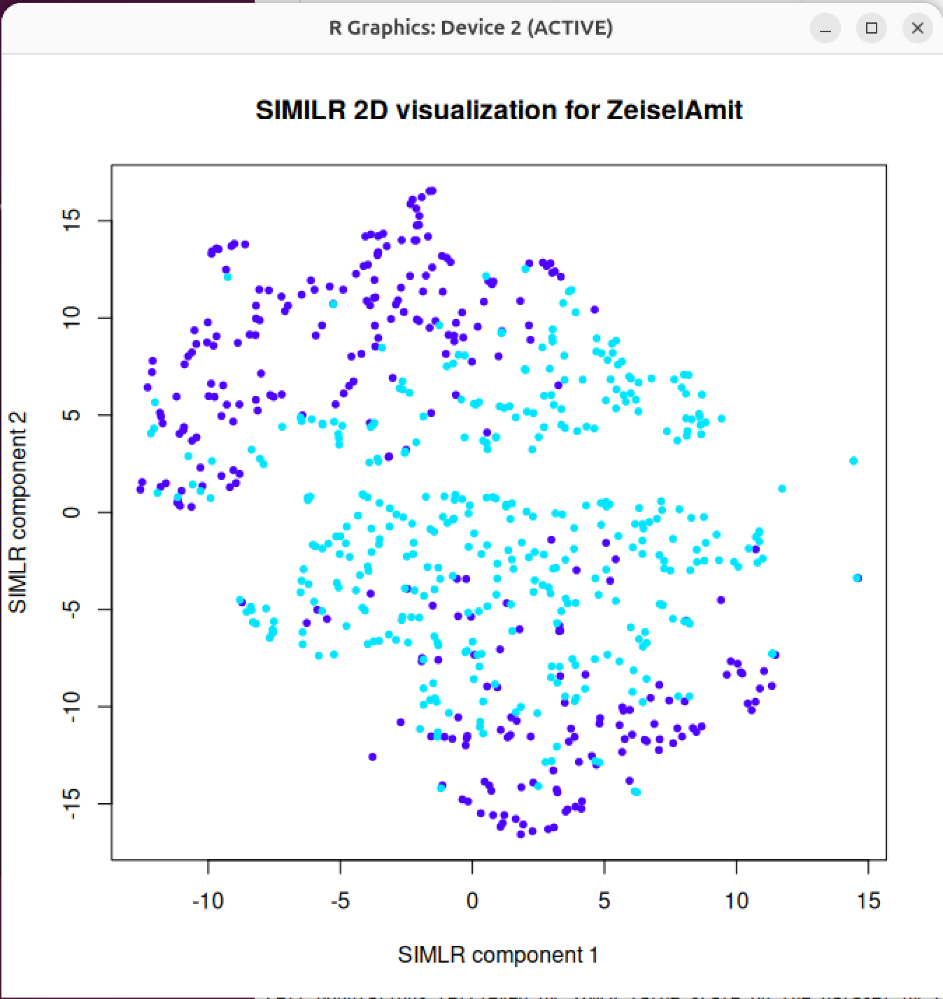

***Engineer 1: Kasandra Pepkolaj***

# Report 1 - DNAscent v2

---

**Paper:** DNAscent v2: detecting replication forks in nanopore sequencing data with deep learning by Michael A. Boemo.  
**Sent by:** Biologist 1  
**Github link:** (https://github.com/MBoemo/DNAscent)  
**Results:** Failed due to computer architecture incompatibility  
**Tools used:** Ubuntu VM, ChatGPT, Claude AI, Google, git, singularity  

---

## **Main issues:**
1. Pre-build Singularity containers were designed for x86_64 architecture, not ARM64 architecture of my laptop. Tried using Singularity image that might work on ARM64 but the size was too big and I encountered hardware warnings (continuous beeping).
2. DNAscent relies on very old dependencies, HDF5 1.8.14, which is not designed for ARM64. Tried to install dependency according to the right architecture, but kept getting architecture errors and compiling issues.

---

## **Steps taken:**

1. Singularity image
	* Copied the commands provided from the instructions on the Github. The recommended way was to run the DNAscent via the supported Singularity images through running:  `singularity pull DNAscent.sif library://mboemo/dnascent/dnascent:4.1.1.`
	* The singularity image also didn't recognize my computer's architecture. After a few changes it seemed that files were being downloaded but this lead to my computer beeping, which signified some RAM issues.

2. Building from Source
	* Cloned the repository: `git clone --recursive https://github.com/MBoemo/DNAscent.git`
	* Followed these commands: `cd DNAscent` --> `git checkout 4.1.1` --> `make`
	* `make` caused errors due to older dependencies. DNAscent tried to download HDF5 version 1.8.14 (2014 version) and compile it manually. However, this version is very old and the scripts didn't recognize ARM64 architecture.
	* Tried updating the scripts, config.guess and config.sub, but this also didn't work.
	* Tried changing the Makefile manually, and this didn't work. I kept getting errors about dependencies that only work with x86_64 architecture.
	
---

# Report 2 - OKseqHMM

---

**Paper:** OKseqHMM: a genome-wide replication fork directionality analysis toolkit  
**Sent by:** Biologist 1  
**Github link:** (https://github.com/CL-CHEN-Lab/OK-Seq)  
**Results: Success!**  
**Tools used:** Ubuntu VM, R, ChatGPT, Google, git, samtools, IGV.    

---

## **Steps taken:**
1. Used a Ubuntu VM instead of Mac, since Mac was presenting package compilation issues. In the VM first step was to download tools and R. Used this command: `sudo apt install -y build-essential libcurl4-gnutls-dev libxml2-dev libssl-dev \  libbz2-dev liblzma-dev zlib1g-dev wget curl git r-base r-base-dev`. 
2. Cloned the github link and received the folder and subfolders. The authors provided sample data of BAM files that can be used. Within the template folder there is sample data and a script template.
3. Opened R and installed packages HMM from CRAN and BiocManager. Then I installed the Bioconductor packages (Rsamtools, GenomicAlignments)
4. Dowloaded the zip file provided that contained the BAM file: `wget http://xfer.curie.fr/get/LfyDX92pNQs/template.bam.zip` and unzipped it: `unzip template.bam.zip` --> received the BAM files as *template_chr21_22.bam and template-chr21_22.bam.bai*.
5. Loaded OKseqHMM in R and ran OKseqHMM in R based on the template script they provided:

	```r
	OKseqHMM(bamfile = "template_chr21_22.bam", thresh=10, chrsizes = "hg19.chr.size.txt",winS=15, fileOut = "hmm",binSize=1000)
	```
	and received the files in the current directory.
6. Loaded OKseqOEM in R and ran the code provided in the template:

	```r 
	OKseqOEM(bamInF = "hmm_fwd.bam",
         	bamInR = "hemm_rev.bam",
         	chrsizes = "hg19.chr.size.txt",
         	fileOut ="hela_OEM",
	 	binsize=1000,
	 	binList=c(1,10,20,50,100,250,500,1000))
	``` 
	and received the .wig files.
	* During this phase I encountered issues with my files from OkseqHMM, mostly due to OKseqOEM trying to detect mapped reads in chr1 and the hg19.chr.size.txt only included up to chr19, while the mapped read of my files were in chr21-ch22.  
	* Ran `samtools view -c hmm_fwd.bam` and `samtools view -c hmm_rev.bam` to confirm that there was data available in my files. Ran `samtools idxstats hmm_fwd.bam` to see where the reads were mapped to. It showed  that chr11-chr20 had no mapped reads and only chr21-ch22 were mapped.
	* Had to create a new file and enter chr21   48129895 chr22   51304566 and used this file instead of the one provided on github. After running OKseqOEM again i finally received the .wig files.
	
## **Final Product - Visualized**



# Report 3 - GENEVIC

---

**Paper:** GENEVIC: GENetic data Exploration and Visualization via Intelligent interactive Console
**Sent by:** Biologist 1  
**Github link:** (https://github.com/bsml320/GENEVIC.git)  
**Results: Success!**  
**Tools used:** Docker, git.

---

## **Steps taken:**
1. Downloaded the Docker image provided for GENEVIC and saved it in a specific directory in my computer.
2. Run the command `docker load -i genevic-v1.tar` in Docker. This loaded the image into my Docker.
3. Run the command `docker run -p 8501:8501 genevic-v1`. The command basically ran the image and made it available so I can access it.
4. Accessed the website by typinf `http://localhost:8501` in my local browser and accessed GENEVIC.

## **Summary of GENEVIC**

GENEVIC is described as "an AI-driven chat framework that tackles this challenge by bridging the gap between genetic data generation and biomedical knowledge discovery. Leveraging generative AI, notably ChatGPT, it serves as a biologist's "copilot." It automates the analysis, retrieval, and visualization of customized domain-specific genetic information, and integrates functionalities to generate protein interaction networks, enrich gene sets, and search scientific literature from PubMed, Google Scholar, and arXiv, making it a comprehensive tool for biomedical research". Very cool! 

The process was very simple to implement and in their github they also provided a manual method of installing. I explored GENEVIC a little more and the website was confusing and very in your face. Thankfully they provide a tutorial which explains the steps you need to take to use the website. To access their website you need Azure's Open AI credentials, mainly Azure OpenAI Endpoint and Azure OpenAI Key. Without these credential's the site won't have the generated AI content. 

Based on the tutorial and information in the site there's three parts:
1. GeneAPIChat: Explore external Bioinformatics websites via automated web API calls; Generate gene-gene interaction network, one or more gene names as input; Perform gene enrichment analysis with reference gene set libraries, given gene list as input; Visualize the network graph; Download the enrichment results as CSV and/or the visualizations in known image formats

2. PGS Chat: Retrieve information from and visualize custom database; Use a question from the Prompts or enter your own question; You can select show code and/or show prompt to show SQL & Python code and the prompt behind the scene.

3. LiteratureSearch: Search for literature evidence in PubMed, Google Scholar, or Arxiv; Search in 1 or 2 or all of websites at the same time; Display the name and links of the articles for any given search query; Displays the abstract of the article, given its link as search query.


# Report 4 - SIMLR

---

**Paper:** SIMLR: A Tool for Large-Scale Genomic Analyses by Multi-Kernel Learning  
**Sent by:** Biologist 1  
**Github link:** (https://github.com/bowang-lab/SIMLR) - Not the link provided from the paper. It was updated to this one.  
**Results: Success!**  
**Tools used:** Ubuntu VM, R, Bioconductor, git.

---

## **Steps taken:**
1. Tried to install the Github version of the tool from R first by using library devtools. After installing a multitude of dependencies i tired to run the script with the example datasets they provided. However, I still couldn't run the provided demo script since it came with pre-compiled binaries meant for a different architecture. This was understandable since this github was last updateD 7-8 years ago.

2. The Bioconductor approach proved more fruitful, but not at first. The link they had provided to source into R did not exist anymore so I couldn't load the tool at all. I searched Bioconductor (the updated link was in the overview section instead, but i found this after I searched on my own) and found a working installation method and an R script to run. The steps were as followed:
	*  
	```r
	if (!require("BiocManager", quietly = TRUE))
    		install.packages("BiocManager")

	BiocManager::install("SIMLR")
	```
	* Then I ran the provided R script.
	
This working method outputted a number of data and 2 pictures depicting the distribution of the 2 datasets, which are displayed below:

1. Figure one showing the 2D visualized distribution for the BuettnerFlorian, the smaller demo dataset.


2. Figure twp showing the 2D visualized distribution for the ZeiselAmit, the bigger demo dataset.


